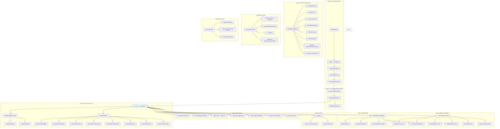

# TU CModel — Architecture Diagram

> Auto-generated from the current module structure.
> Rendered at: `docs/architecture-diagram.md`

```mermaid
graph TB
    subgraph "Layer 5: Compiler & Tooling"
        ONNX["ONNX Model"] --> Compiler["ONNX → TU Compiler"]
        Compiler --> ASM["TU ASM (text/binary)"]
        ASM --> Scheduler["ISA Scheduler (C2)"]
        Scheduler --> Allocator["Liveness Allocator (C3)"]
    end

    subgraph "Layer 4: TU ISA & Command Interface"
        Allocator --> ISA["tu_isa (encoder/decoder)"]
        ISA --> CmdQ["Command Queue (E1)"]
        CmdQ --> MMIO["MMIO Register Map"]
    end

    subgraph "Layer 3: TU Core (tu_core_t)"
        CmdQ --> Core["tu_core_t — Orchestrator"]
        Core --> Dataflow["Dataflow Dispatcher (A4)"]
        Dataflow --> WS["Weight-Stationary"]
        Dataflow --> OS["Output-Stationary"]
        Core --> Compute["Compute Engines"]
        Compute --> MMA["Systolic Array (GEMM)"]
        Compute --> Conv["Convolution Engine (O2)"]
        Compute --> Attn["Attention Engine (O3)"]
        Compute --> EW["Elementwise Pipeline (O4)"]
        Compute --> Norm["Normalization Engine (O5)"]
        Compute --> Pool["Pooling Engine (O6)"]
        Compute --> SM["Softmax Engine (O7)"]
        Compute --> Pipeline["Pipeline Controller (E2)"]
    end

    subgraph "Layer 2: Memory Subsystem"
        Core --> MemHier["Memory Hierarchy (A3)"]
        MemHier --> RegFile["Register File (Level 0)"]
        MemHier --> SPAD["Local Scratchpad (Level 1)"]
        MemHier --> GBuf["Global Buffer (Level 2)"]
        MemHier --> DRAM["DRAM Model (Level 3)"]
        MemHier --> DblBuf["Double Buffer (A7)"]
        MemHier --> AddrGen["Address Generator (M3)"]
    end

    subgraph "Layer 2b: DMA Engine"
        Core --> DMA["DMA Engine (DM1/DM2)"]
        DMA --> Desc["DMA Descriptors"]
        DMA --> Scatter["Scatter/Gather (DM3)"]
        DMA --> Multicast["Broadcast/Multicast (DM4)"]
        DMA --> SPAD
        DMA --> DRAM
    end

    subgraph "Layer 1: Precision & Numerics"
        Precision["tu_precision Registry"] --> FP16["FP16 (IEEE 754)"]
        Precision --> BF16["BF16 (1-8-7)"]
        Precision --> TF32["TF32 (1-8-10) (D3)"]
        Precision --> FP8["FP8 E4M3/E5M2 (D4)"]
        Precision --> INT8["INT8 Quant (D2)"]
        Precision --> INT4["INT4 Quant (D2)"]
        Precision --> Round["Rounding: RNE/RTZ/Stochastic (D6)"]
        Precision --> Subnormal["Subnormal: Full/FTZ (D7)"]
    end

    subgraph "Layer 0: Infrastructure"
        Core --> Perf["Performance Counters"]
        Core --> Power["Power/Energy Model (E4)"]
        Core --> Trace["Event Trace — VCD (P2.7)"]
        Core --> Log["Structured Logging (Q2)"]
        Core --> Debug["Debug & Observability (I3)"]
        Core --> Errors["Exception Handling (E5)"]
        Core --> Config["Config Loader (A1)"]
    end

    subgraph "Multi-Core (A5)"
        Core --> Cluster["tu_cluster_t"]
        Cluster --> ICC["Inter-Core Communication"]
        Cluster --> Contexts["Multi-Context (E3)"]
    end

    subgraph "Verification (V1-V6)"
        Tests["Test Suite (25+ files)"] --> Golden["Golden Reference (PyTorch)"]
        Tests --> Random["Random/Differential Testing"]
        Tests --> CI["CI Pipeline"]
        Tests --> Bench["Comparative Benchmarking (P2.9/V5)"]
    end

    subgraph "Documentation (Q4)"
        Docs["docs/ (45+ files)"] --> Doxygen["Doxygen API Docs"]
        Docs --> ConfigRef["Auto-Generated Config Reference"]
        Docs --> Diagrams["Architecture Diagrams"]
    end

    style Layer fill:#f5f5f5
    style Core fill:#e1f5fe
    style MemHier fill:#fff3e0
    style Precision fill:#f3e5f5
    style DMA fill:#e8f5e9
```
